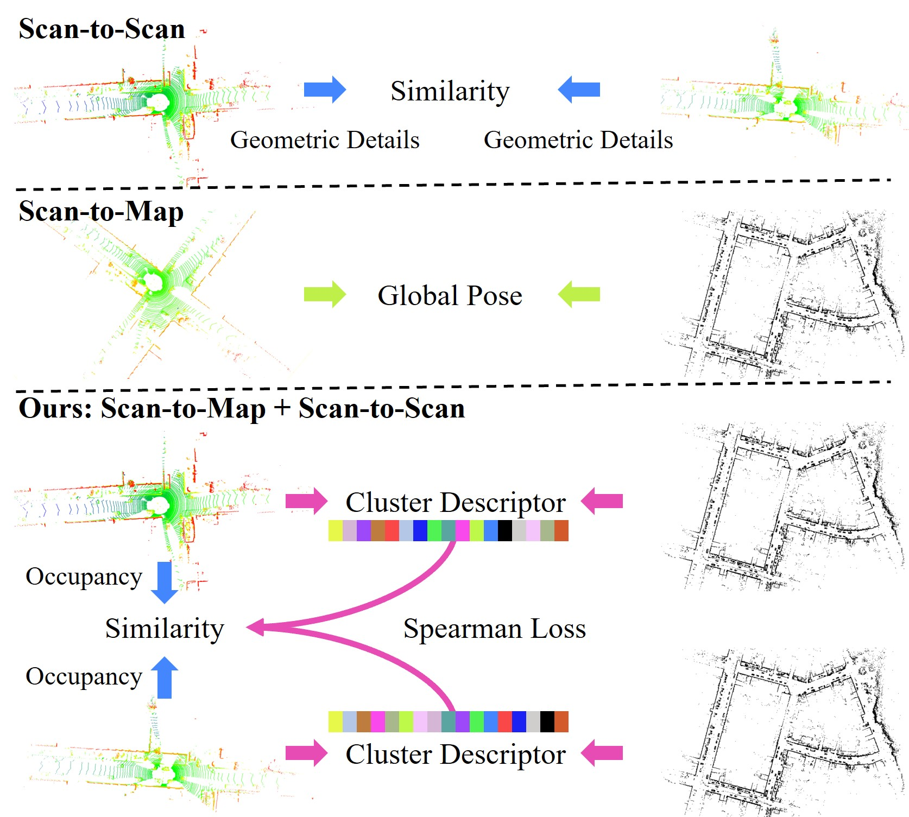

# MCS (Map Clustering Similarity)

MCS is a LiDAR-based place recognition framework merging both scan-to-scan and scan-to-map comparisons. It is accepted by IEEE TIV. [A New Horizon: Employing Map Clustering Similarity for LiDAR-based Place Recognition](https://ieeexplore.ieee.org/document/10416737)
<!-- # Pipeline Overview

[A New Horizon: Employing Map Clustering Similarity for LiDAR-based Place Recognition](https://ieeexplore.ieee.org/document/10416737) -->


# Differences: MCS vs. Current Methods
* ***Fresh perspective***: Despite employing the prior map, we simplify it into multiple cluster centers for constructing a cluster descriptor, thus avoiding intricate scan-to-map matching. 
* ***Lightweight design***: Our LiDAR descriptor (OcSC) solely judges whether a region is occupied rather than computing geometric details like height, normals, and density. 
* ***2-phase search without KD tree***: cluster descriptor + Spearman loss, OcSC LiDAR descriptor + Occupancy loss. We can achieve good efficiency without constructing a KD tree.


# Dependencies
```
CMake
PCL
OpenCV
Boost
Eigen
```
<!-- # Publication

Shi P, Li J, Zhang Y. LiDAR localization at 100 FPS: A map-aided and template descriptor-based global method[J]. International Journal of Applied Earth Observation and Geoinformation, 2023, 120: 103336. -->
# File and Data Structure
### Data structure
```bash
data
    |---KITTI
    |       |---00
    |            |---gt
    |                 |---gt_poses.txt
    |                 |---loop_nn.txt
    |            |---map
    |                 |---cnts_4_20_60_3.bin
    |                 |---cnts_4_20_60_3.txt 
    |                 |---map_ring_keys_4_20_60_3.txt
    |            |---pcd
    |                 |---0.pcd
    |                 |---1.pcd
    |                 |---2.pcd
    |                 |---...
    |       |---01
    |       |---02
    |       |---...
    |---...
```
### Files
* loop_nn.txt: a loop flag file based on a 8m threshold. Take a line as an example: (835 0 1 2 3 4 5 6 7) means the 835th scan froms a loop closure with 0th-7th scan.
* gt_poses.txt: each row stores a 4*4 pose
* cnts_4_20_60_3: map cluster centers file
* map_ring_keys_4_20_60_3: map ring keys
# How to use?
MCS pipeline comprises two parts: (1) offline map processing, (2) online place recognition. 
## 1. Build the project
```
mkdir build && cd build
cmake .. 
make -j16
```
**Note:** In KITTI Odometry, we've generated necessary offline map files, allowing the bypass of ***offline map processing*** for direct ***online place recognition***. When testing in other datasets, ***offline map processing*** is required to generate the necessary map files before place recognition.
Move the point cloud to the "pcd" directory prior to execution.
## 2. Offline map processing
### 2.1 Create map point cloud and virtual points
```
./offline_map_process/create_virtual_pts_and_map
```
you will get a "map_sam_pro.pcd" (***map***) and a "ground_sam_dist_3.pcd" (***virtual points***) in map folder .
### 2.2 Create map cluster centers (4 Kb)
```
./offline_map_process/create_map_cluster_centers
```
or run the matlab script (we use this in our experiments)
```
k_means.m
```
you will get a "cnts_4_20_60_3.bin" (***map cluster centers***) in map folder. After this, all necessary map files are generated.
## 3. Online place recognition
We provide the evaluation code (recall top 1) for MCS and MCS-BF. MCS (two-phase search) balances the runtime and accuracy, while MCS-BF (one-phase search) may showcase better accuracy.
### 3.1 Run MCS
```
./online_place_recognition/mcs_recall_1
```
### 3.2 Run MCS-BF
```
./online_place_recognition/mcs_bf_recall_1
```

# Citation
If you think this work is useful for your research, please consider citing:

```
@ARTICLE{10416737,
  author={Shi, Pengcheng and Xiao, Yilin and Chen, Wenqing and Li, Jiayuan and Zhang, Yongjun},
  journal={IEEE Transactions on Intelligent Vehicles}, 
  title={A New Horizon: Employing Map Clustering Similarity for LiDAR-based Place Recognition}, 
  year={2024},
  volume={},
  number={},
  pages={1-11},
  doi={10.1109/TIV.2024.3360321}}
```
# Acknowledgement
Thanks to the source code of some great works such as [linefit](https://github.com/lorenwel/linefit_ground_segmentation)

# Contact
For any questions or bug reports, please create an issue or contact me at shipc_cs@outlook.com.